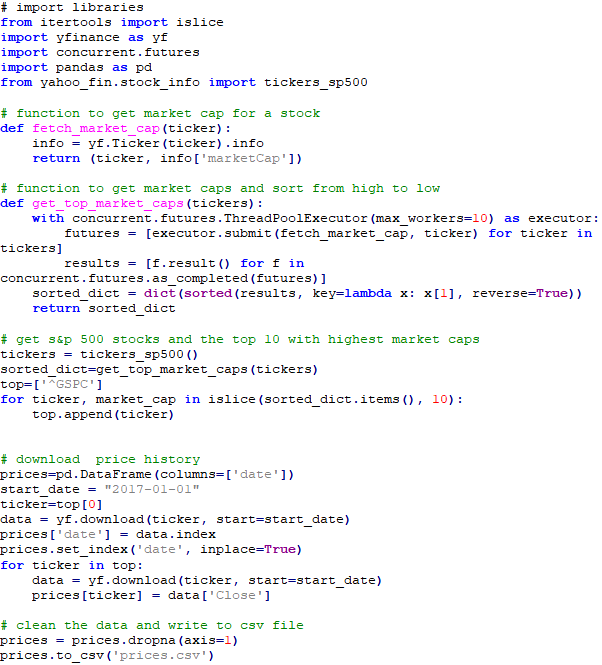
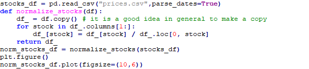
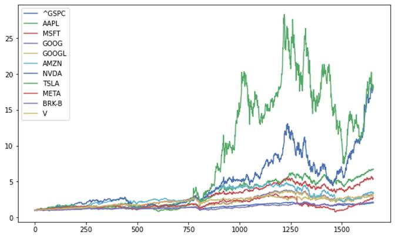
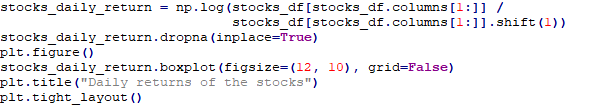
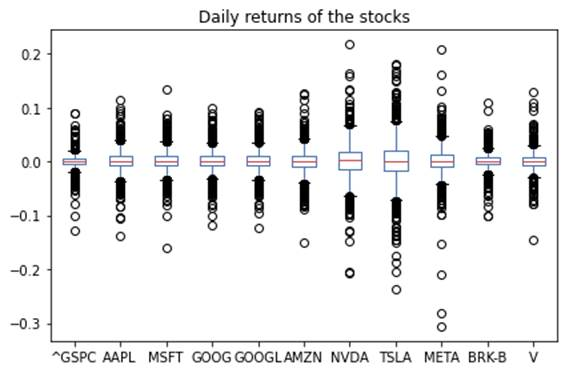
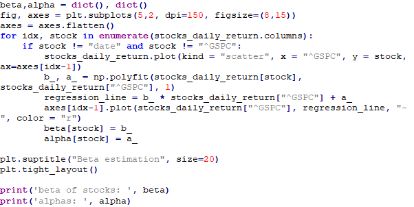
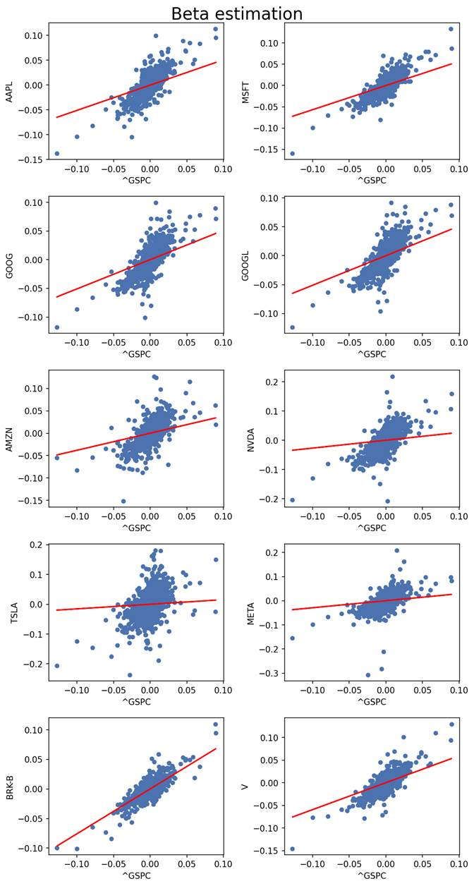

# CAPM
Capital Asset Pricing Model
<html>

<head>
<meta http-equiv=Content-Type content="text/html; charset=windows-1252">
<meta name=Generator content="Microsoft Word 15 (filtered)">

</head>

<body lang=EN-US link="#0563C1" vlink="#954F72" style='word-wrap:break-word'>

Capital Asset Pricing Model

The Capital Asset Pricing Model (CAPM) is an extension of Modern
Portfolio Theory  adding a risk-free asset and tangency portfolio. It implies
that all investors should hold the market portfolio and use the risk-free asset
to get their desired risk-return balance.

$$R_i = R_f + \beta_i (R_M - R_f) + \alpha_i$$

Python Implementation

Let’s download price history for some stocks first:

Let’s first plot normalized prices to compare the stocks:

It is also interesting to compare daily returns of the
stocks visually:

Finally, we can use linear regression to find beta and alpha
of CAPM for the stocks:

 

beta of stocks:  {'AAPL': 0.5091844444362879, 'MSFT':
0.5670966860183329, 'GOOG': 0.5097519466273185, 'GOOGL': 0.5112833526889965,
'AMZN': 0.381875009947157, 'NVDA': 0.26801456306099175, 'TSLA':
0.15447695327300753, 'META': 0.29085094846764137, 'BRK-B': 0.7587520693768666,
'V': 0.5950445266698097}

alphas:  {'AAPL': -0.00016004019236124555, 'MSFT':
-0.00014939103413591894, 'GOOG': 5.41066295515083e-05, 'GOOGL':
6.22657994903881e-05, 'AMZN': 0.00013831178723413732, 'NVDA':
-4.327448191184829e-05, 'TSLA': 0.0001570016031842059, 'META':
0.0002485735972727812, 'BRK-B': 7.601288136505303e-05, 'V':
3.003164321841307e-05}

Kelliher, C., 2022.&nbsp;<i
style='font-variant-ligatures: normal;font-variant-caps: normal;orphans: 2;
widows: 2;-webkit-text-stroke-width: 0px;text-decoration-thickness: initial;
text-decoration-style: initial;text-decoration-color: initial;word-spacing:
0px'>Quantitative Finance with Python: A Practical Guide to Investment
Management, Trading, and Financial Engineering</i>. CRC Press.

<a
href="https://webcache.googleusercontent.com/search?q=cache:2xJnoB4XZEwJ:https://medium.com/mlearning-ai/the-capital-asset-pricing-model-capm-financial-analysis-in-python-1a7a4f2c7650&amp;cd=3&amp;hl=en&amp;ct=clnk&amp;gl=lu">https://webcache.googleusercontent.com/search?q=cache:2xJnoB4XZEwJ:https://medium.com/mlearning-ai/the-capital-asset-pricing-model-capm-financial-analysis-in-python-1a7a4f2c7650&amp;cd=3&amp;hl=en&amp;ct=clnk&amp;gl=lu</a>

https://www.mlq.ai/capital-asset-pricing-model-python/

&nbsp;

</body>

</html>
